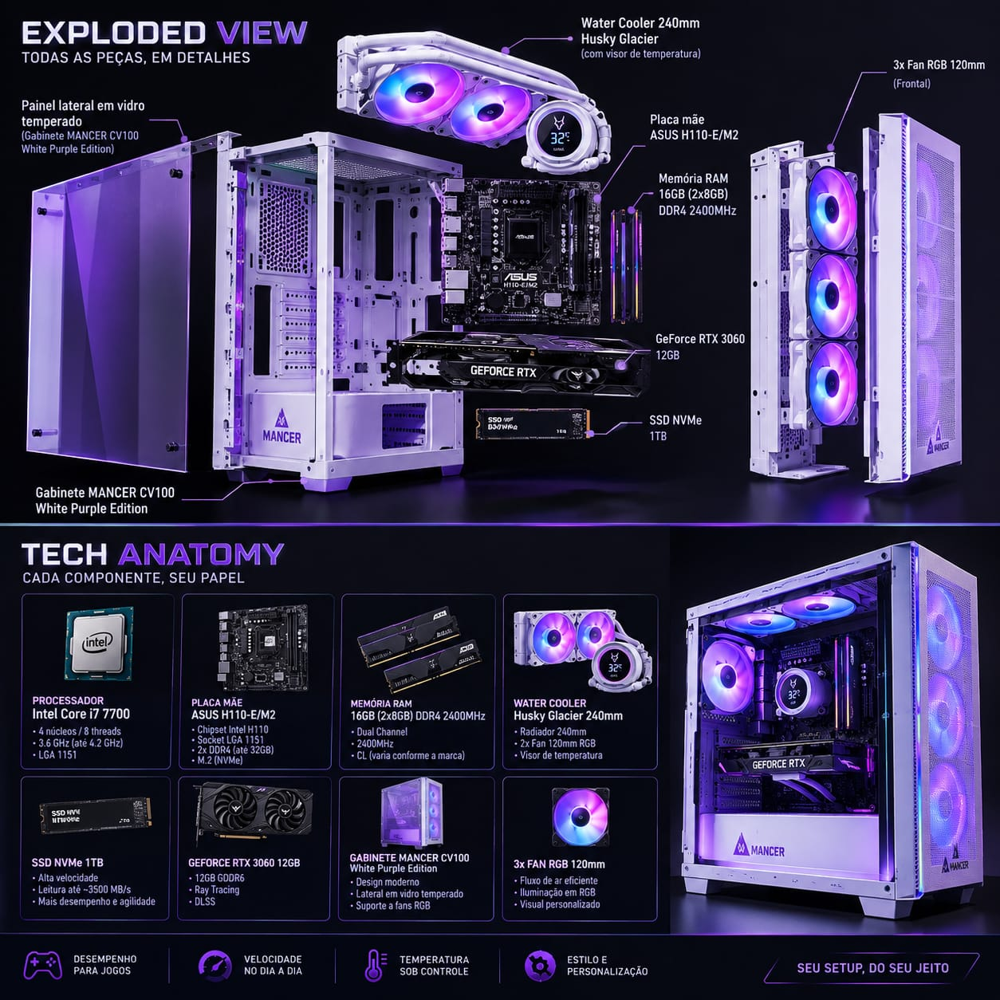
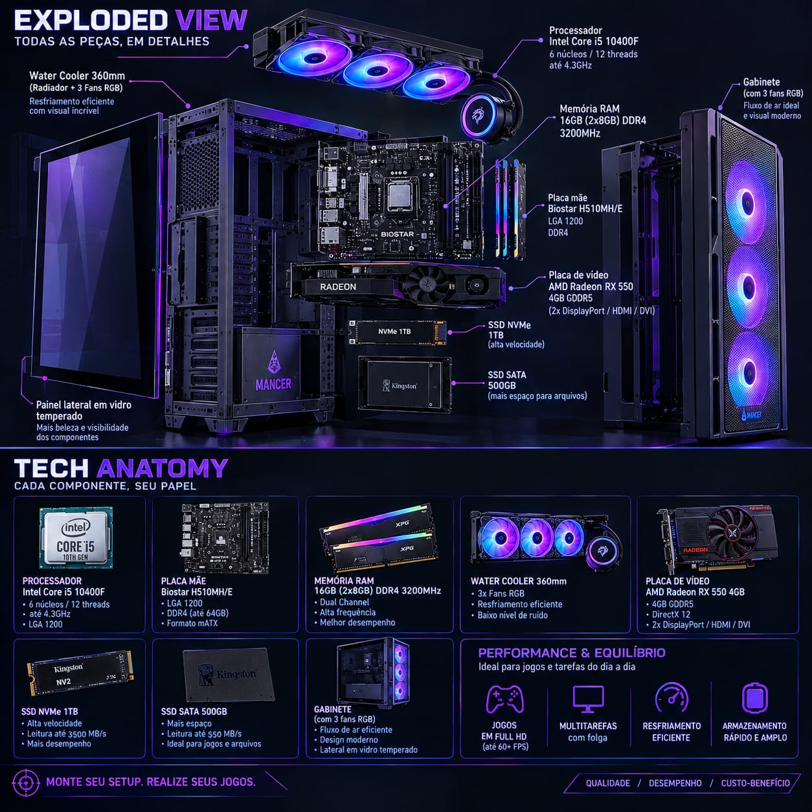
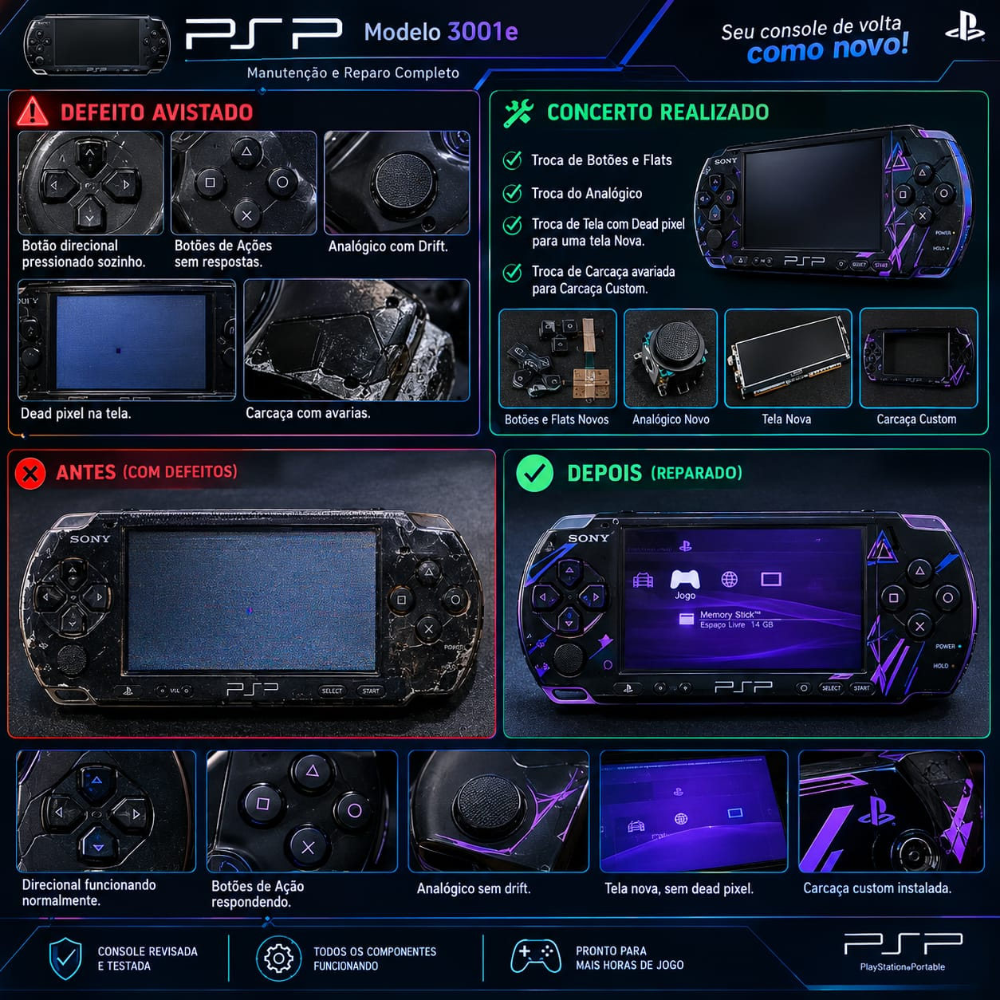

# 🔧 Portfólio - Montagem e Manutenção de Hardware

Documentação técnica com Exploded View e Antes/Depois. Foco em compatibilidade, refrigeração e acabamento.

---
### 01 - White Purple Build - i7 7700 + RTX 3060 12GB

Gabinete MANCER CV100 White Purple Edition. Build premium com foco em estética e fluxo de ar.

**Config:** i7 7700, H110, 16GB DDR4, RTX 3060 12GB, NVMe 1TB, Water Cooler Husky Glacier 240mm

### 02 - Black Build - i5 10400F + RX 550 4GB

Build custo-benefício com duplo armazenamento.

**Config:** i5 10400F, H510, 16GB DDR4, RX 550 4GB, NVMe 1TB + SSD SATA 500GB, Water Cooler Husky 360mm

### 03 - Restauração PSP 3001e - Antes e Depois

Restauração completa com múltiplas falhas.

**Defeitos:** Botão direcional pressionando sozinho, botões sem resposta, analógico com drift, tela com dead pixel, carcaça avariada.
**Solução:** Troca de botões, flats, analógico, tela e carcaça custom. Testado e funcionando.

---
**Autor:** Igor Ribeiro | Técnico de Hardware
**Técnicas:** Montagem LGA 1151/1200, cable management, fluxo de ar, diagnóstico de portáteis
